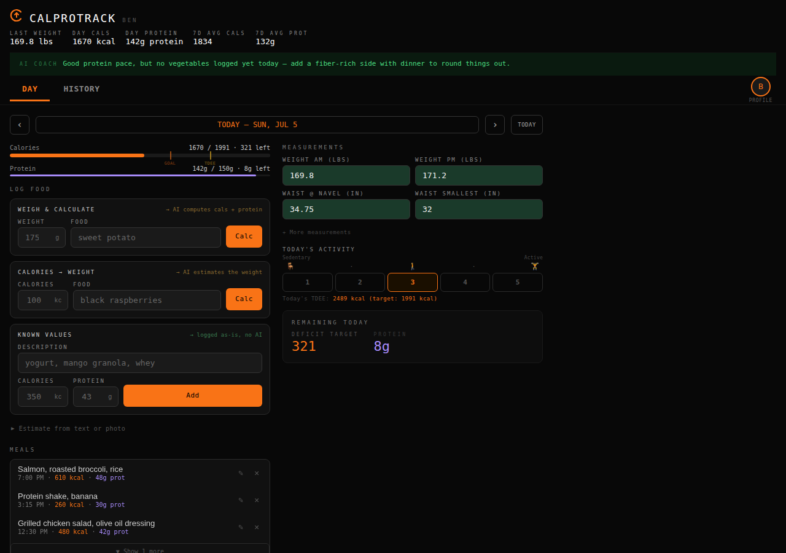
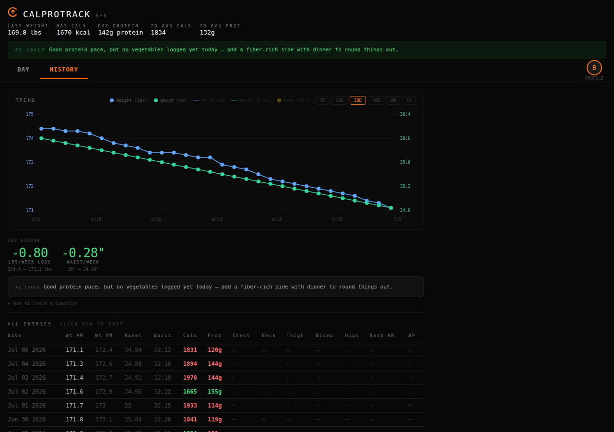
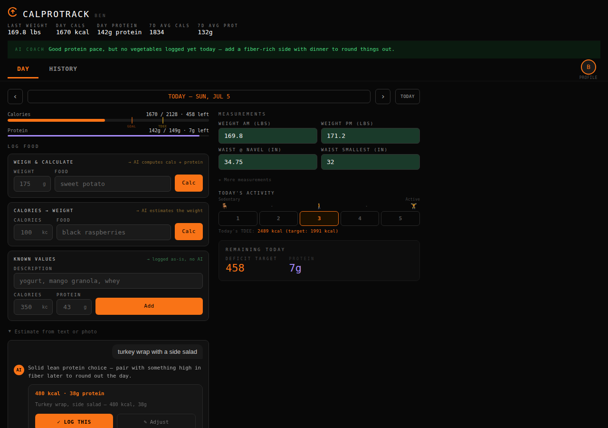
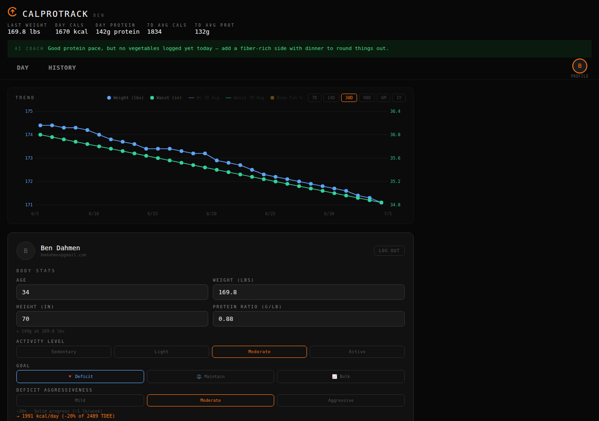

# CalProTrack

A calorie and protein tracker with an AI nutrition coach. Log meals by weight,
by calorie target, or by free-text/photo description and let Claude estimate
the macros; track daily weight, waist, and other body measurements; and get a
running AI coach insight on today's intake plus long-term trend analysis.

## Screenshots

**Day view** — calorie/protein progress, quick food logging, measurements, and
today's AI coach insight.



**History & trends** — weight/waist chart over time with rate-of-change
callouts and full entry history.



**AI food estimation** — describe a meal (or snap a photo) and Claude returns
calories, protein, and a running commentary.



**Profile** — body stats, activity level, goal mode, and deficit/bulk
aggressiveness, all feeding the daily calorie/protein targets.



## How it works

- **Frontend**: a single self-contained `index.html` (no build step), deployed
  to Cloudflare Pages by `.github/workflows/deploy-pages.yml` on every push to
  `main` that touches it.
- **Backend**: `worker.js`, a Cloudflare Worker that fronts a D1 database and
  proxies AI calls to the Anthropic API (with a model-cascade retry on
  overload). Auth is Google Sign-In, with server-side session tokens (see
  `migrations/0002_add_sessions_table.sql`).
- **Database**: Cloudflare D1 (`migrations/*.sql`), tracking users, meals,
  measurements, denormalized daily history, an AI-response cache (keyed by a
  fingerprint of the inputs, so unchanged days don't re-call the model), and
  per-user daily rate limits.

## Development

There's no build step for the frontend — it's one HTML file. To iterate on
the worker locally:

```
wrangler dev
```

To apply a new migration:

```
wrangler d1 execute calorie --local --file=migrations/000N_your_migration.sql   # local
wrangler d1 execute calorie --remote --file=migrations/000N_your_migration.sql  # production
```
